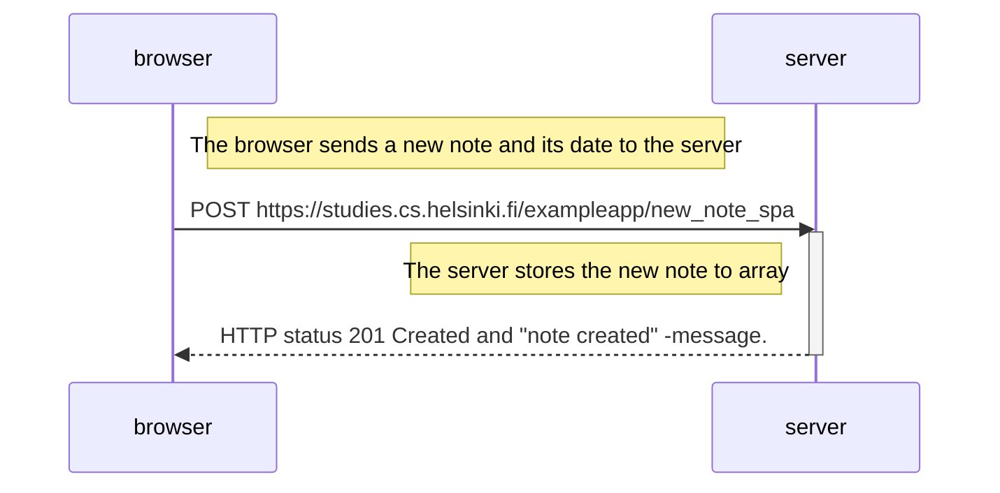

```mermaid
sequenceDiagram
    participant browser
    participant server
    
    Note right of browser: The browser sends a new note and its date to the server
    
    browser->>server: POST https://studies.cs.helsinki.fi/exampleapp/new_note_spa
    activate server
    
    Note left of server: The server stores the new note to array
    
    server-->>browser: HTTP status 201 Created and "note created" -message.
    deactivate server
```

